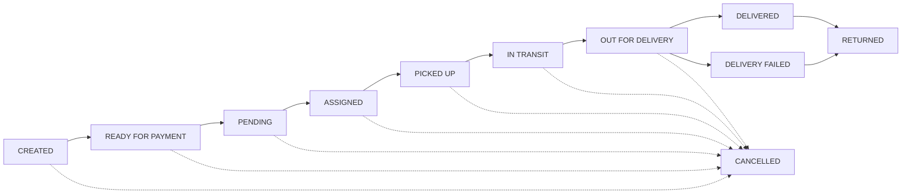

<div align="center">

# 🚚 SwiftCourier

### Courier & Logistics Management Platform

**A modern, role-based web platform that connects customers, couriers, and administrators to move parcels from pickup to delivery — with live tracking, scheduling, payments, and operations management.**

[](https://nextjs.org)
[](https://react.dev)
[](https://www.typescriptlang.org)
[](https://tailwindcss.com)
[](https://tanstack.com/query)
[](https://zod.dev)
[](https://leafletjs.com)
[](https://biomejs.dev)
[](https://pnpm.io)

[Backend Repository](https://github.com/Hayder987/swift-courier-backend) ·
[Backend Live URL](https://swiftcourier-backend.vercel.app) ·
[Portfolio](https://hayder4290.vercel.app) ·
[GitHub](https://github.com/Hayder987)

</div>

---

## 📖 Table of Contents

- [Project Overview](#-project-overview)
- [Features](#-features)
- [User Roles and Permissions](#-user-roles-and-permissions)
- [Shipment Lifecycle](#-shipment-lifecycle)
- [Technology Stack](#-technology-stack)
- [Architecture and Project Structure](#-architecture-and-project-structure)
- [Prerequisites](#-prerequisites)
- [Installation and Setup](#-installation-and-setup)
- [Environment Variables](#-environment-variables)
- [API Integration](#-api-integration)
- [Database and Domain Model](#-database-and-domain-model)
- [Security and Validation](#-security-and-validation)
- [External Integrations](#-external-integrations)
- [Testing and Quality](#-testing-and-quality)
- [Deployment](#-deployment)
- [Screenshots and Demo](#-screenshots-and-demo)
- [Roadmap](#-roadmap)
- [Contributing](#-contributing)
- [License](#-license)
- [Author and Contact](#-author-and-contact)
- [Closing](#-closing)

---

## 🚀 Project Overview

**SwiftCourier** is a courier and logistics management platform built to digitise the full parcel journey — from when a customer creates a shipment, through courier pickup and delivery, to payment settlement and back-office reporting.

This repository is the **frontend application**. It is a Next.js App Router project that delivers four role-specific experiences on top of a single REST API:

| Audience | What they get |
| --- | --- |
| 🧑 **Customers** | Create shipments, track them, pay for deliveries, apply to become a courier, and manage a profile and live location. |
| 🛵 **Couriers** | A delivery workspace with pickup and delivery job queues, status updates, and location sharing. |
| 🛡️ **Admins** | Day-to-day operations: courier approvals, zones, employees, users, shipments, and payroll. |
| 👑 **Super Admins** | Platform-wide administration, employee account creation, and audit log visibility. |

**The business problem it solves:** courier operations are usually fragmented across phone calls, spreadsheets, and disconnected tools. SwiftCourier centralises shipment intake, courier dispatch, status tracking, geolocation, payment, and administration into one consistent, role-aware web platform.

### Primary workflows

1. **Authentication** — email/password with OTP email verification and password reset, plus Google OAuth sign-in.
2. **Shipment creation** — a customer uploads a parcel image, provides pickup coordinates (browser geolocation or map selection) and a delivery address.
3. **Payment** — a customer starts a hosted checkout session and is redirected back to success/cancel pages.
4. **Dispatch** — an admin reviews the shipment and assigns a courier.
5. **Pickup & delivery** — the assigned courier advances the shipment through pickup and delivery statuses with notes.
6. **Tracking & notifications** — status history and notifications keep users informed.
7. **Administration** — zones, courier applications, employees, users, payroll, and audit logs.

> **Scope note:** This repository contains the frontend only. The REST API, database, authentication sessions, payment provider, media storage, and email delivery are implemented in the connected [backend repository](https://github.com/Hayder987/swift-courier-backend) and are not defined here.

---

## ✨ Features

Features below are implemented in this repository.

### 🔐 Authentication & Account Security
- Email/password **sign-up and login** with strong password rules.
- **Email OTP verification** with a 6-digit code and resend support.
- **Forgot password / reset password** flows driven by OTP.
- **Google OAuth** sign-in via `@react-oauth/google`.
- Cookie-based session handling (`credentials: "include"` on every API request).
- Client-side **route protection** with an auth guard and a role guard.
- Profile photo upload.

### 🧑‍💼 User & Employee Management
- Admin **user management** with filtering, detail sheets, status updates (active/suspended), and soft delete.
- Admin **employee management** with filters by role, status, and zone, plus detail and delete flows.
- Super-admin **employee account creation** for `ADMIN` and `COURIER` roles, including salary structure fields.
- Role-aware profile pages for every signed-in user.

### 🛵 Courier Onboarding & Management
- Customer-facing **courier application** form with resume, vehicle documents, and national ID uploads.
- Admin/super-admin **courier application review** with approve/reject decisions and applicant detail views.
- Courier **availability and zone** association surfaced in employee details.

### 📦 Shipment Creation & Tracking
- Multi-step shipment creation with **parcel image upload**, weight, description, pickup coordinates, and delivery address.
- **Admin shipment management** with status filters, status timeline, and courier assignment.
- **Customer "My Shipments"** view with per-parcel detail sheets and payment actions.
- **Courier job queues** split into `pickup` and `delivery` views.
- Full **status history** (`tracking` entries with note, latitude/longitude, and timestamp).

### 💳 Payment
- Customer-initiated **hosted checkout session** per shipment.
- Dedicated **payment success** and **payment cancel** pages, with the checkout session id surfaced on success.
- Payment status and delivery fee shown across shipment views.

### 🔔 Notifications
- In-app notification center (slide-over sheet) with typed notifications: `GENERAL`, `SHIPMENT`, `PAYMENT`, `APPLICATION`.
- Unread indicator and per-notification delete.

### 📊 Dashboards & Reporting
- Admin/super-admin **stats dashboard** powered by a single stats endpoint: overview counters, shipment status distribution, shipment and revenue trends, payment distributions, courier availability & performance, and recent audit activity.
- Charts rendered with **Recharts**.
- Period selection (`7d`, `30d`, `90d`, `1y`).

### 🗺️ Location, Zones & Distance
- Browser **geolocation** capture for pickup and live location.
- **Leaflet / OpenStreetMap** maps for pickup selection, live location, zone boundaries, and courier directions.
- **Zone management** (create, list, update, delete) with radius, active flag, and a **GeoJSON polygon boundary**.
- Courier **direction view** with straight-line (Haversine) distance to the destination.

### 💰 Payroll
- Admin **payroll generation** by month/year with bonus and deductions.
- Payroll listing, detail sheet, and **salary payment** with a payment reference.

### 🧾 Auditing
- Super-admin **audit log** browser with filters by action, resource, type, and date, plus detail dialog and delete.

### 🔎 Search, Filtering & Pagination
- Query-param driven filtering across shipments, users, employees, zones, payroll, and audit logs.
- Consistent pagination envelope (`page`, `limit`, `total`, `totalPages`).

### 🎨 Experience & UI
- Marketing site (Home, About, Services, FAQ, Contact) with **React Three Fiber** 3D scenes.
- **Light/dark theme** support via `next-themes`.
- Motion and micro-interactions with **Framer Motion**.
- Skeleton loaders, global progress bars, and toast notifications.
- Responsive dashboards built on a shadcn-style component library.

---

## 👥 User Roles and Permissions

Roles are defined in the frontend as `SUPER_ADMIN`, `ADMIN`, `COURIER`, and `CUSTOMER`. Access to each dashboard is enforced client-side by a `RoleGuard` that only renders children when the signed-in user's role matches, otherwise showing an **Access Denied** screen and redirecting unauthenticated users to `/login`.

| Role | Dashboard | Verified frontend capabilities |
| --- | --- | --- |
| **CUSTOMER** | `/customer-dashboard` | Overview, profile, create shipment, my shipments, pay for shipments, apply to become a courier, live location. |
| **COURIER** | `/courier-dashboard` | Overview, profile, my courier jobs (pickup/delivery), update assigned shipment status, live location sharing & directions. |
| **ADMIN** | `/admin-dashboard` | Overview, profile, courier applications (approve/reject), zone management, employee management, shipment management & courier assignment, user management, payroll management. |
| **SUPER_ADMIN** | `/super-admin-dashboard` | Overview, profile, **audit logs**, courier applications, zone management, employee management, user management, and **employee account creation**. |

> The frontend guards are a UX layer, not the security boundary. Final authorisation for every API operation is enforced by the backend, which is the source of truth for permissions.

---

## 🔄 Shipment Lifecycle

Shipment status is a typed union of 11 values. The transition map defined in [`src/utils/DashBoard/shipment.utils.ts`](src/utils/DashBoard/shipment.utils.ts) is modelled below.



**Role responsibilities in the flow (as implemented in the UI):**

- **Admin** can advance a shipment to `READY_FOR_PAYMENT`, `ASSIGNED`, `IN_TRANSIT`, `OUT_FOR_DELIVERY`, `DELIVERED`, `DELIVERY_FAILED`, `RETURNED`, or `CANCELLED`, and can assign a courier.
- **Courier (pickup side)** can mark an `ASSIGNED` shipment as `PICKED_UP`.
- **Courier (delivery side)** can mark an `OUT_FOR_DELIVERY` shipment as `DELIVERED` or `DELIVERY_FAILED`.
- Every status change requires a **note**, and each update is recorded to the shipment's tracking history.
- `RETURNED` and `CANCELLED` are terminal states.

> The transition map above reflects the frontend's model. Actual allowed transitions and side effects (such as payment confirmation moving a shipment to `PENDING`) are validated by the backend.

---

## 🛠️ Technology Stack

| Category | Technology | Notes |
| --- | --- | --- |
| **Framework** | Next.js `16.3.5` (App Router) | React Server Components, route groups, React Compiler enabled. |
| **Language** | TypeScript `^5` | Strict mode enabled (`tsconfig.json`). |
| **UI Library** | React `19.2.8`, React DOM `19.2.8` | — |
| **Styling** | Tailwind CSS `^4`, `tw-animate-css` | CSS-first Tailwind v4 via `@tailwindcss/postcss`. |
| **Components** | shadcn-style primitives, `@base-ui/react`, `class-variance-authority` | Config in `components.json` (`base-nova` style). |
| **Icons** | lucide-react, react-icons | — |
| **Animation & 3D** | Framer Motion, three.js, `@react-three/fiber`, `@react-three/drei` | Hero/About/warehouse scenes. |
| **Data Fetching** | TanStack Query `^5` | Query cache, suspense queries, mutations & invalidation. |
| **HTTP Client** | ofetch `^1.5` | Central instance in `src/lib/apiClient.ts`. |
| **Forms** | TanStack Form `^1` | Field-level state and validation. |
| **Validation** | Zod `^4` | Schemas in `src/validation`. |
| **Maps** | Leaflet `^1.9`, react-leaflet `^5` | OpenStreetMap raster tiles (no map API key). |
| **Charts** | Recharts `^3` | Dashboard visualisations. |
| **Dates** | date-fns, react-day-picker | Filtering and calendars. |
| **Theming** | next-themes | Light/dark mode. |
| **Tooling** | Biome `2.4.2` | Linting + formatting (VCS-aware). |
| **Package Manager** | pnpm `11.17.0` | Declared via `packageManager`. |

---

## 🏗️ Architecture and Project Structure

The app follows a **feature-by-domain, layered** structure:

- **`app/`** — routing and layouts. Route groups separate the public marketing/auth area from the authenticated `(dashboard)` area.
- **`api/`** — one typed API module per backend domain, all sharing the `ofetch` client.
- **`hooks/`** — TanStack Query hooks that wrap the API modules (queries and mutations).
- **`validation/`** — Zod schemas used for form validation and as payload types.
- **`types/`** — domain TypeScript contracts for API responses and UI models.
- **`components/`** — presentation, split into `ui/` primitives, `layout/` modules per area, `auth/` guards, `common/`, `loading/`, and `skeleton/`.
- **`routes/`** — role-based sidebar route maps.
- **`providers/`** — app-wide providers (Google auth, React Query, theme).

```
swift-courier-frontend/
├── public/                        # Static assets served as-is
├── src/
│   ├── api/                       # Typed API clients (auth, shipment, payment, zone, ...)
│   ├── app/                       # Next.js App Router
│   │   ├── (dashboard)/           # Authenticated, role-guarded dashboards
│   │   │   ├── admin-dashboard/
│   │   │   ├── super-admin-dashboard/
│   │   │   ├── courier-dashboard/
│   │   │   └── customer-dashboard/
│   │   ├── (public)/              # Public site
│   │   │   ├── (authentication)/  # login, register, verify, forgot/reset password
│   │   │   └── (marketing)/       # home, about, services, faq, contact
│   │   ├── payment/               # success / cancel return pages
│   │   ├── layout.tsx             # Root layout, fonts, providers, toaster
│   │   ├── error.tsx / not-found.tsx
│   │   └── globals.css
│   ├── assets/                    # Brand logo and service illustrations
│   ├── components/
│   │   ├── auth/                  # AuthGuard, RoleGuard, AccessDenied, LogoutButton
│   │   ├── common/                # Maps, pagination, logo, no-data views
│   │   ├── layout/                # dashboard/ + public/ + modules/
│   │   ├── loading/  skeleton/    # Loading and skeleton states
│   │   └── ui/                    # Reusable UI primitives
│   ├── hooks/                     # TanStack Query hooks per domain
│   ├── lib/                       # apiClient, constants, static content, utils
│   ├── providers/                 # Query, Google auth, theme providers
│   ├── routes/                    # Role-based sidebar route definitions
│   ├── types/                     # Domain types
│   ├── utils/                      # Formatters and domain helpers
│   └── validation/                # Zod schemas
├── biome.json
├── components.json
├── next.config.ts                 # React Compiler + static export
├── package.json
├── pnpm-lock.yaml
├── pnpm-workspace.yaml
├── postcss.config.mjs
└── tsconfig.json
```

**Key architectural details**

- `next.config.ts` sets `output: "export"`, so production builds emit a **static site** to `out/`, with `images.unoptimized: true`.
- A single `apiClient` (`ofetch.create`) applies `baseURL` from `NEXT_PUBLIC_API_BASE_URL` and `credentials: "include"` to every request.
- The `(dashboard)` root layout is wrapped by `AuthGuard`; each role dashboard layout adds a `RoleGuard` and the shared `DashboardShell` (sidebar, header, notifications, theme toggle).

---

## ⚙️ Prerequisites

| Requirement | Version / Notes |
| --- | --- |
| **Node.js** | A version compatible with Next.js 16 and React 19 (Node 20+ recommended). |
| **pnpm** | `11.17.0` (declared in `package.json`). |
| **SwiftCourier backend API** | Required. The frontend needs a reachable REST API base URL. |
| **Google OAuth client ID** | Required for Google sign-in. |

> No `engines` field is declared in `package.json`, so no exact Node version is enforced by the repository.

---

## 📥 Installation and Setup

**1. Clone the repository**

```bash
git clone <repository-url>
cd swift-courier-frontend
```

**2. Install dependencies** (pnpm is the declared package manager)

```bash
pnpm install
```

**3. Configure environment variables**

Create a `.env` (or `.env.local`) file in the project root:

```env
NEXT_PUBLIC_API_BASE_URL=http://localhost:5000/api/v1
NEXT_PUBLIC_GOOGLE_CLIENT_ID=your-google-oauth-client-id
```

`.env*` files are git-ignored in this repository — do not commit real values.

**4. Start the development server**

```bash
pnpm dev
```

Open [http://localhost:3000](http://localhost:3000) in your browser.

**5. Build for production**

```bash
pnpm build
```

Because `output: "export"` is configured, the build produces a static site in the `out/` directory. Serve that directory with a static host or file server.

> The team must also make the **backend API** available and reachable from the browser at the URL configured in `NEXT_PUBLIC_API_BASE_URL`, and configure the Google OAuth client to allow the frontend origin.

### Available scripts

| Script | Command | Purpose |
| --- | --- | --- |
| `dev` | `next dev` | Start the development server. |
| `build` | `next build` | Build the app (static export to `out/`). |
| `start` | `next start` | Start the Next.js server (the repository is configured for static export). |
| `lint` | `biome check .` | Run Biome linting and checks. |
| `lint:fix` | `biome check --write .` | Apply safe lint/assist fixes. |
| `format` | `biome format .` | Check formatting. |
| `format:fix` | `biome format --write .` | Apply formatting. |

---

## 🔐 Environment Variables

| Variable | Required | Purpose | Safe placeholder |
| --- | --- | --- | --- |
| `NEXT_PUBLIC_API_BASE_URL` | ✅ Yes | Base URL of the SwiftCourier backend REST API, including the versioned `/api/v1` prefix. Used by the shared `ofetch` client. | `http://localhost:5000/api/v1` |
| `NEXT_PUBLIC_GOOGLE_CLIENT_ID` | ✅ Yes | Google OAuth 2.0 client ID used by the Google sign-in provider. The app throws a startup error if it is missing. | `your-google-oauth-client-id` |

Both variables are prefixed with `NEXT_PUBLIC_`, meaning they are exposed to the browser. Never place server secrets in these variables. All other secrets belong to the backend.

---

## 🔌 API Integration

This is a **frontend-only** repository, so it does not define a backend API. Instead, it consumes a versioned REST API through a single `ofetch` client:

- **Base URL:** `NEXT_PUBLIC_API_BASE_URL` (configured with a `/api/v1` prefix).
- **Auth transport:** cookie-based sessions (`credentials: "include"`).
- **Response envelope:** most endpoints return `{ success, message, data, meta? }`, where `meta` is `{ page, limit, total, totalPages }`.
- **Error handling:** errors are read from the `ofetch` `FetchError` shape, preferring `error.data?.message` then `error.data?.errors?.[0]?.message`.

The endpoints below are the ones **called by this frontend** (verified in `src/api/`). They are grouped by domain:

### Authentication & Account

| Method | Endpoint | Purpose | Auth |
| --- | --- | --- | --- |
| `POST` | `/auth/login` | Sign in with email and password. | Public |
| `POST` | `/auth/sign-up` | Register a new customer account. | Public |
| `POST` | `/auth/verify-email` | Verify email with a 6-digit OTP. | Public |
| `POST` | `/auth/resend-otp` | Resend an email/verify OTP. | Public |
| `POST` | `/auth/forgot-password` | Request a password reset OTP. | Public |
| `POST` | `/auth/reset-password` | Reset the password using an OTP. | Public |
| `POST` | `/auth/google` | Exchange a Google `idToken` for a session. | Public |
| `POST` | `/auth/logout` | End the current session. | Authenticated |
| `GET` | `/users/me` | Fetch the current user and profile. | Authenticated |
| `PATCH` | `/users/profile-image` | Upload/replace the profile image (`multipart/form-data`, field `profileImage`). | Authenticated |

### Shipments

| Method | Endpoint | Purpose | Called from |
| --- | --- | --- | --- |
| `POST` | `/shipments` | Create a shipment (`multipart/form-data`: `data`, `ItemsImage`). | Customer |
| `GET` | `/shipments` | List all shipments with filters/pagination. | Admin |
| `GET` | `/shipments/my-shipments` | List the current customer's shipments. | Customer |
| `GET` | `/shipments/courier-shipments/:type` | List courier jobs; `:type` is `pickup` or `delivery`. | Courier |
| `PATCH` | `/shipments/admin-status/:shipmentId` | Update shipment status as admin. | Admin |
| `PATCH` | `/shipments/courier-status/:shipmentId` | Update shipment status as courier (`PICKED_UP`, `DELIVERED`, `DELIVERY_FAILED`). | Courier |
| `PATCH` | `/shipments/assign/:shipmentId` | Assign a courier to a shipment. | Admin |

**Shipment query parameters** include `page`, `limit`, `sortBy`, `sortOrder`, `searchTerm`, `status`, `pickupZoneId`, `deliveryZoneId`, `dateFilter` (`today` \| `yesterday` \| `last_week`), and `type` (`NEW` \| `OLD`).

### Payments

| Method | Endpoint | Purpose | Called from |
| --- | --- | --- | --- |
| `POST` | `/payments/create` | Create a hosted checkout session for a shipment (`{ shipmentId }`); the response provides a `checkoutUrl` the browser is redirected to. | Customer |

### Courier Applications & Employees

| Method | Endpoint | Purpose | Called from |
| --- | --- | --- | --- |
| `POST` | `/employee/be-courier` | Submit a courier application (`multipart/form-data`: `data`, `resume`, `vehicleDocuments`, `nationalIdPic`). | Customer |
| `GET` | `/employee/jobs` | List courier applications. | Admin / Super Admin |
| `PATCH` | `/employee/jobs/:employeeId` | Approve or reject an application (`{ status: "APPROVED" \| "REJECTED" }`). | Admin / Super Admin |
| `GET` | `/employee/all-employee` | List employees with filters. | Admin |
| `GET` | `/employee/emp/:id` | Fetch a single employee. | Admin |
| `PATCH` | `/employee/emp/:id` | Deactivate/suspend an employee. | Admin |

### Users

| Method | Endpoint | Purpose | Called from |
| --- | --- | --- | --- |
| `GET` | `/users/all-user` | List users with filters. | Admin / Super Admin |
| `GET` | `/users/user/:userId` | Fetch a single user and profile. | Admin / Super Admin |
| `PATCH` | `/users/user/:userId/status` | Update user status (`ACTIVE` \| `SUSPENDED`). | Admin / Super Admin |
| `PATCH` | `/users/user/:userId` | Soft-delete a user. | Admin / Super Admin |

### Super Admin

| Method | Endpoint | Purpose | Auth |
| --- | --- | --- | --- |
| `POST` | `/super/admin/create-employee` | Create an `ADMIN` or `COURIER` employee account, including salary structure. | Super Admin |
| `GET` | `/super/admin/logs` | List audit logs with filters. | Super Admin |
| `DELETE` | `/super/admin/log/:auditId` | Delete an audit log entry. | Super Admin |

### Zones, Payroll, Notifications, Dashboard & Contact

| Method | Endpoint | Purpose | Called from |
| --- | --- | --- | --- |
| `POST` | `/zones` | Create a zone. | Admin / Super Admin |
| `GET` | `/zones` | List zones (paginated). | Admin / Super Admin |
| `PATCH` | `/zones/:zoneId` | Update a zone. | Admin / Super Admin |
| `DELETE` | `/zones/:zoneId` | Delete a zone. | Admin / Super Admin |
| `POST` | `/payroll/generate` | Generate payroll for a month/year. | Admin |
| `GET` | `/payroll/paid` | List paid payroll records. | Admin |
| `PATCH` | `/payroll/:payrollId/pay` | Mark a payroll as paid (`{ paymentReference }`). | Admin |
| `GET` | `/notifications/all-notifications` | List the current user's notifications. | Authenticated |
| `DELETE` | `/notifications/:id` | Delete a notification. | Authenticated |
| `GET` | `/dashboard/stats` | Fetch dashboard statistics (`?period=7d\|30d\|90d\|1y`). | Admin / Super Admin |
| `POST` | `/contacts` | Submit the public contact form. | Public |
| `POST` | `/location/generate` | Save/resolve the current user's live location (`{ latitude, longitude }`). | Authenticated |

> Endpoint behaviour, validation, and role restrictions are ultimately controlled by the backend. "Called from" reflects where the frontend issues each request.

---

## 🗄️ Database and Domain Model

This repository **does not contain a database schema, ORM, or migrations** — those live in the backend repository. The frontend defines TypeScript contracts for the API data it consumes. The core domain entities implied by those contracts are:

| Entity | Key fields (as consumed) | Relationships |
| --- | --- | --- |
| **User** | `id`, `name`, `email`, `phone`, `role`, `status`, `authMethod`, `isEmailVerified`, `lastLoginAt` | Has one profile (employee or customer); owns shipments as a customer. |
| **Employee profile** | `employeeCode`, `employmentStatus`, `joinAt`, salary structure | Belongs to a `User`; may have a `Courier` record. |
| **Courier** | `vehicleLicenseNumber`, `qualifications`, `applicationStatus`, `zoneId`, `courierAvailability` | Belongs to an `Employee`; belongs to a `Zone`. |
| **Customer profile** | `timezone`, `country` | Belongs to a `User`. |
| **Zone** | `name`, `code`, `address`, `latitude`, `longitude`, `radiusKm`, `boundary` (GeoJSON Polygon), `isActive` | Linked to shipments (pickup/delivery) and couriers. |
| **Shipment** | `trackingNumber`, `parcelName`, `parcelWeightGM`, `deliveryFee`, `deliveryDistance`, `status`, `type` | Belongs to a customer; references pickup and delivery couriers and zones. |
| **Shipment tracking entry** | `status`, `note`, `lat`, `lng`, `updatedById`, `createdAt` | Belongs to a shipment (status history). |
| **Payment** | status (`PAID`, `PENDING`, `FAILED`, `CANCELLED`), method (`CARD`) | Belongs to a shipment. |
| **Payroll** | `month`, `year`, `basicSalary`, allowances, `deliveryEarning`, `bonus`, `deduction`, `netSalary`, `status` | Belongs to an employee. |
| **Notification** | `title`, `message`, `type`, `isRead`, `shipmentId` | Belongs to a user; optionally references a shipment. |
| **Audit log** | `action`, `type` (`CURRENT`/`OLD`), `resource`, `resourceId`, `metadata`, `createdAt` | Belongs to the acting user. |

---

## 🔒 Security and Validation

### Implemented in this repository

- **Session-based auth** — the API client sends credentials with every request; there are no tokens stored in `localStorage`.
- **Route protection** — `AuthGuard` redirects unauthenticated visitors to `/login`; `RoleGuard` renders dashboards only for the matching role and shows an Access Denied screen otherwise.
- **Client-side validation with Zod** — registration, login, password reset, shipment creation, courier application, zone, payroll, contact, and status-update schemas.
- **Strong password rules** — minimum length plus lower/upper case, number, and special character requirements; registration enforces E.164 phone format.
- **File upload constraints** — shipment item images are limited to `image/jpeg`, `image/png`, `image/webp` and **5 MB**. Courier application files are limited to PDF/DOC/DOCX/PNG/JPEG, also **5 MB**, with caps of **1–5 vehicle documents** and **1–2 national ID files**.
- **Status transitions** — the UI only offers statuses valid for the current state and role.
- **User-facing error feedback** — toasts surface backend error messages without exposing internals.
- **Secret hygiene** — `.env*` files are git-ignored; only `NEXT_PUBLIC_` variables are read by the app.

### Owned by the backend (not implemented here)

Authentication sessions, OTP/email verification, password hashing, authorisation for each endpoint, rate limiting, CORS, security headers, and payment webhook verification are the responsibility of the [backend](https://github.com/Hayder987/swift-courier-backend). They cannot be verified from this repository.

---

## 💳 External Integrations

| Integration | Where it is used | Status / configuration |
| --- | --- | --- |
| **Google Identity** (`@react-oauth/google`) | Login and registration | Requires a valid `NEXT_PUBLIC_GOOGLE_CLIENT_ID`. The provider throws if it is missing. |
| **Hosted payment checkout** | `POST /payments/create` → redirect to `checkoutUrl`; `/payment/success` and `/payment/cancel` handle the return. | Provider is configured server-side. The success page reads a `session_id` query parameter. The provider itself is not defined in this repo. |
| **OpenStreetMap tiles** via Leaflet | Pickup map, live location, zone boundaries, courier directions. | Public tile server; **no map API key required**. Attribution is rendered on the maps. |
| **Browser Geolocation API** | Pickup location capture, live location, courier direction. | Requires user permission; graceful errors are shown for denied/unavailable/timed-out locations. |
| **Remote media storage** | Profile images and courier/shipment documents | API responses include media URLs and `publicId` fields; the storage provider is configured in the backend. |
| **Email delivery** | OTP verification, password reset | Triggered by backend endpoints; no email library is present in the frontend. |

---

## 🧪 Testing and Quality

**Code quality tooling is configured; there is no automated test suite in this repository.**

- **Biome 2.4.2** provides linting, formatting, and import organisation (`biome.json`), with Next.js and React domain rules and Tailwind directive parsing.

```bash
pnpm lint        # biome check .
pnpm lint:fix    # biome check --write .
pnpm format      # biome format .
pnpm format:fix  # biome format --write .
```

- TypeScript is configured in **strict mode**.
- No `test` script, test runner, or test files were found in the repository.

> No lint, format, type-check, or build results are asserted here; run the commands locally to verify.

---

## 🚀 Deployment

The repository is configured for a **static export** (`output: "export"` in `next.config.ts`), which produces a self-contained site in `out/` after `pnpm build`. This output is well suited to static hosting platforms, including Vercel.

**Build and serve**

```bash
pnpm build
# Static output is written to ./out
# Serve ./out with any static host/server
```

**Production checklist**

- Set `NEXT_PUBLIC_API_BASE_URL` to the deployed backend API URL (with the `/api/v1` prefix).
- Set `NEXT_PUBLIC_GOOGLE_CLIENT_ID` to a client ID that authorises the production origin.
- Ensure the backend has the correct frontend origin in its CORS and cookie configuration, and the correct payment success/cancel redirect URLs.
- Because the variables are public (`NEXT_PUBLIC_`), never store server secrets in them.

**Connected backend**

- Repository: [https://github.com/Hayder987/swift-courier-backend](https://github.com/Hayder987/swift-courier-backend)
- Live URL (supplied by the project owner): [https://swiftcourier-backend.vercel.app](https://swiftcourier-backend.vercel.app)

> The backend live URL is provided by the owner. Its availability and individual endpoint health have not been verified from this repository. A frontend deployment URL is not defined in this repository and is therefore not listed.

---

## 🖥️ Screenshots and Demo

No screenshots or verified public demo URL are included in this repository. Screenshots of the public site and the four dashboards can be added here later.

---

## 🗺️ Roadmap

Possible future improvements (not yet implemented in this repository):

- An automated test suite (unit and end-to-end) with a `test` script.
- Real-time shipment updates via WebSockets or server-sent events.
- Internationalisation (i18n) and additional locales.
- Offline-friendly PWA capabilities.
- Expanded accessibility audits and automated checks.

---

## 🤝 Contributing

Contributions are welcome. To keep the codebase consistent:

1. **Branch** — create a descriptive branch, e.g. `feat/shipment-filters` or `fix/login-redirect`.
2. **Follow existing patterns** — add API calls in `src/api`, data hooks in `src/hooks`, validation in `src/validation`, and types in `src/types`.
3. **Keep changes focused** — one feature or fix per pull request.
4. **Write clear commits** — short, imperative commit messages describing the change.
5. **Check quality before pushing** — run `pnpm lint` and `pnpm build`.
6. **Open a pull request** — describe what changed, why, and how to verify it.

Please do not commit secrets, `.env` files, or unrelated generated files.

---

## 📄 License

No `LICENSE` file is present in this repository, and no license is specified in `package.json`. Unless the project owner states otherwise, all rights are reserved.

---

## 👨‍💻 Author and Contact

**Hayder Ali — Full Stack Developer**

<div align="center">

[](mailto:hayderbd4290@gmail.com)
[](https://github.com/Hayder987)
[](https://www.linkedin.com/in/hayder-ali-bb9175349)
[](https://hayder4290.vercel.app)

</div>

| | |
| --- | --- |
| 📧 **Email** | [hayderbd4290@gmail.com](mailto:hayderbd4290@gmail.com) |
| 📱 **Phone** | +8801771814597 |
| 🐙 **GitHub** | [github.com/Hayder987](https://github.com/Hayder987) |
| 💼 **LinkedIn** | [linkedin.com/in/hayder-ali-bb9175349](https://www.linkedin.com/in/hayder-ali-bb9175349) |
| 🌐 **Portfolio** | [hayder4290.vercel.app](https://hayder4290.vercel.app) |
| 🔗 **Backend Repository** | [github.com/Hayder987/swift-courier-backend](https://github.com/Hayder987/swift-courier-backend) |
| 🚀 **Backend Live URL** | [swiftcourier-backend.vercel.app](https://swiftcourier-backend.vercel.app) |

---

## ⭐ Closing

**SwiftCourier** brings the whole delivery journey into one place — customers create and pay for shipments, couriers move them from pickup to doorstep, and administrators keep the operation running with zones, payroll, and auditing. This frontend is built to be fast, type-safe, and maintainable with Next.js 16, React 19, TanStack Query, Zod, and Tailwind CSS.

If you find this project useful or interesting, a ⭐ on the repository is always appreciated.

<div align="center">

**Built with ❤️ by [Hayder Ali](https://github.com/Hayder987)**

</div>
