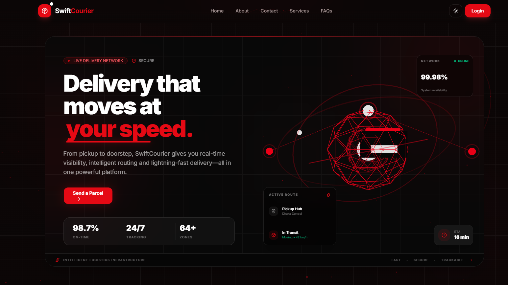
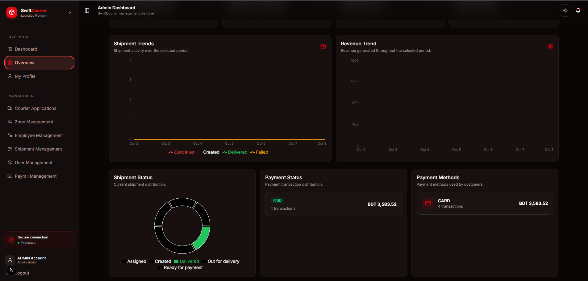
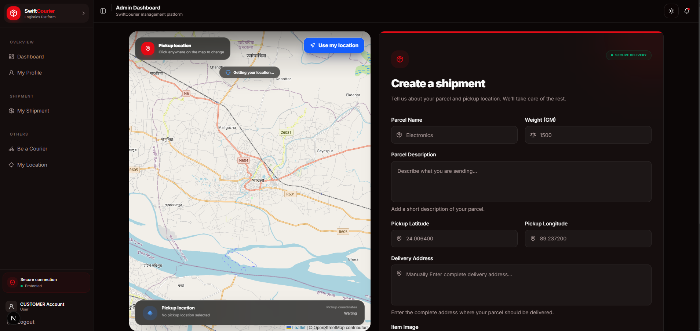
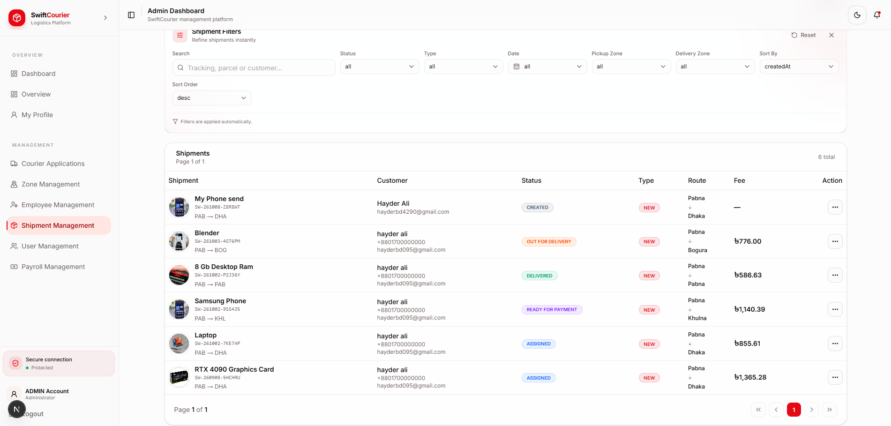
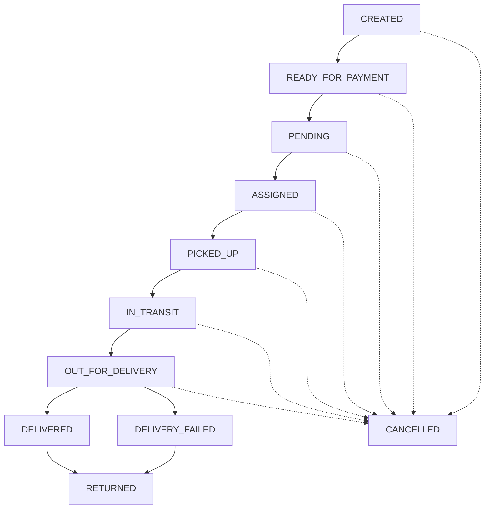

<div align="center">

# 🚚 SwiftCourier

### Courier & Logistics Management Platform

**A modern, role-based courier and logistics platform for managing the complete parcel journey — from shipment creation and online payment to courier dispatch, delivery tracking, and business operations.**

<p>
  <a href="https://nextjs.org"></a>
  <a href="https://react.dev"></a>
  <a href="https://www.typescriptlang.org"></a>
  <a href="https://tailwindcss.com"></a>
  <a href="https://tanstack.com/query"></a>
  <a href="https://zod.dev"></a>
  <a href="https://leafletjs.com"></a>
  <a href="https://biomejs.dev"></a>
</p>

<p>
  <a href="https://github.com/Hayder987/swift-courier-backend">Backend Repository</a> ·
  <a href="https://swiftcourier-backend.vercel.app">Backend API</a> ·
  <a href="https://hayder4290.vercel.app">Portfolio</a> ·
  <a href="https://github.com/Hayder987">GitHub Profile</a>
</p>

</div>

---

## 📸 Project Preview

### Courier & Logistics Management Platform

<table>
  <tr>
    <td width="50%">
      <a href="./public/screenshot1.png">
        
      </a>
    </td>
    <td width="50%">
      <a href="./public/screenshot2.png">
        
      </a>
    </td>
  </tr>
  <tr>
    <td width="50%">
      <a href="./public/screenshot3.png">
        
      </a>
    </td>
    <td width="50%">
      <a href="./public/screenshot4.png">
        
      </a>
    </td>
  </tr>
</table>

<p align="center">
  <sub>Product screenshots from the SwiftCourier frontend.</sub>
</p>

---

## 📚 Table of Contents

- [Overview](#-overview)
- [Core Features](#-core-features)
- [Roles and Permissions](#-roles-and-permissions)
- [Shipment Lifecycle](#-shipment-lifecycle)
- [Technology Stack](#-technology-stack)
- [Architecture](#-architecture)
- [Getting Started](#-getting-started)
- [Environment Variables](#-environment-variables)
- [Available Scripts](#-available-scripts)
- [API Integration](#-api-integration)
- [Security and Validation](#-security-and-validation)
- [External Integrations](#-external-integrations)
- [Quality Checks](#-quality-checks)
- [Deployment](#-deployment)
- [Roadmap](#-roadmap)
- [Contributing](#-contributing)
- [License](#-license)
- [Author](#-author)

---

## 🚀 Overview

**SwiftCourier** is a role-based courier and logistics management platform designed to digitise and organise the complete parcel delivery workflow. Customers can create shipments and manage payments, couriers can handle assigned pickup and delivery jobs, and administrators can manage day-to-day logistics operations from a centralised interface.

This repository contains the **frontend application**, built with Next.js App Router, React, TypeScript, and Tailwind CSS. It connects to a versioned REST API provided by the [SwiftCourier backend](https://github.com/Hayder987/swift-courier-backend).

### The problem it solves

Courier operations can become fragmented across phone calls, spreadsheets, manual dispatching, and disconnected tracking tools. SwiftCourier brings shipment intake, courier assignment, delivery status, location features, payment workflows, and operational administration together in one role-aware application.

### Main workflows

1. **Account access** — register, sign in, verify email, reset passwords, and use Google sign-in.
2. **Shipment creation** — enter parcel details, upload an item image, and specify pickup and delivery information.
3. **Payment** — start a hosted checkout flow and return to the payment success or cancellation page.
4. **Dispatch** — administrators review shipments and assign couriers.
5. **Pickup and delivery** — couriers update shipment progress and record tracking notes.
6. **Tracking and notifications** — users can review shipment status history and notifications.
7. **Operations management** — administrators manage users, employees, courier applications, zones, payroll, and audit logs.

> **Scope:** This repository is the frontend only. API logic, database access, backend authorisation, payment verification, email delivery, and media storage are handled by the connected backend service.

---

## ✨ Core Features

### 🔐 Authentication and Account Management

- Email and password registration and sign-in.
- Six-digit email OTP verification with resend support.
- Forgot-password and reset-password workflows.
- Google OAuth sign-in through `@react-oauth/google`.
- Cookie-based session requests using `credentials: "include"`.
- Authentication and role-based route guards.
- User profile and profile-image management.

### 📦 Shipment Management

- Multi-step shipment creation with parcel details and image upload.
- Pickup location capture using browser geolocation and map selection.
- Customer shipment list with detail views and payment actions.
- Admin shipment management with status filters and courier assignment.
- Courier job queues for pickup and delivery.
- Shipment tracking history with status, note, coordinates, and timestamp.

### 🛵 Courier Applications and Operations

- Customer-facing courier application form.
- Resume, vehicle document, and national ID file uploads.
- Admin and super-admin application review with approve/reject actions.
- Courier availability and zone information.
- Courier shipment status updates and destination directions.

### 💳 Payments

- Shipment checkout session creation through the backend.
- Redirect to the hosted checkout URL.
- Dedicated payment success and cancellation pages.
- Payment status and delivery fee visibility in shipment views.

### 👥 User and Employee Administration

- User listing, filtering, detail views, status updates, and soft deletion.
- Employee listing with role, employment status, and zone filters.
- Super-admin employee creation for admin and courier roles.
- Employee detail and status management.

### 🗺️ Maps, Geolocation, and Zones

- Browser geolocation for pickup and live location.
- Leaflet maps using OpenStreetMap tiles.
- Pickup selection, zone boundaries, and courier directions.
- Zone create, list, update, and delete workflows.
- Zone radius, active status, and GeoJSON polygon boundary support.
- Straight-line distance calculations for courier directions.

### 📊 Dashboards and Reporting

- Admin and super-admin statistics dashboards.
- Overview counters and shipment status distribution.
- Shipment and revenue trends.
- Payment distribution and courier availability/performance views.
- Recent audit activity.
- Dashboard period selection: `7d`, `30d`, `90d`, and `1y`.
- Charts powered by Recharts.

### 💰 Payroll

- Payroll generation by month and year.
- Bonus and deduction fields.
- Payroll listing and detail views.
- Salary payment action with a payment reference.

### 🔔 Notifications and Audit Logs

- In-app notification center.
- Notification types: `GENERAL`, `SHIPMENT`, `PAYMENT`, and `APPLICATION`.
- Unread indicator and notification deletion.
- Super-admin audit log filtering by action, resource, type, and date.

### 🎨 User Experience

- Responsive public marketing pages and role-specific dashboards.
- Light and dark theme support.
- Motion and micro-interactions with Framer Motion.
- Skeleton loading states, global progress indicators, and toast feedback.
- Reusable UI primitives and shared dashboard layouts.
- Search, filters, sorting, and pagination across supported modules.

---

## 👥 Roles and Permissions

The frontend defines four user roles. Dashboard access is organised around each role, while the backend remains responsible for enforcing actual API permissions.

| Role | Dashboard route | Main capabilities |
|---|---|---|
| `CUSTOMER` | `/customer-dashboard` | Profile, create shipments, manage own shipments, pay for shipments, apply to become a courier, and manage location. |
| `COURIER` | `/courier-dashboard` | Profile, view pickup/delivery jobs, update eligible shipment statuses, and share location or view directions. |
| `ADMIN` | `/admin-dashboard` | Dashboard, courier applications, zones, employees, shipments and courier assignment, users, and payroll. |
| `SUPER_ADMIN` | `/super-admin-dashboard` | Dashboard, audit logs, courier applications, zones, employees, users, and employee account creation. |

> **Security note:** Frontend route guards improve the user experience; they are not a security boundary. The backend must validate identity, permissions, and allowed operations for every protected request.

---

## 🔄 Shipment Lifecycle

The frontend models the following shipment statuses and transitions. The backend is the source of truth for validating actual state transitions and payment-related side effects.



### Workflow responsibilities

- **Admin:** manages eligible shipment statuses and assigns couriers.
- **Courier:** can mark an assigned shipment as `PICKED_UP`; delivery-side actions include `DELIVERED` and `DELIVERY_FAILED` where allowed by the current state.
- **Tracking history:** status changes include a note and are recorded in shipment tracking history.
- **Terminal statuses:** `RETURNED` and `CANCELLED` are treated as terminal in the frontend flow.

---

## 🛠️ Technology Stack

| Category | Technology | Purpose |
|---|---|---|
| Framework | Next.js 16 App Router | Routing, layouts, and application structure |
| UI | React 19 | Component-based interface |
| Language | TypeScript 5 | Typed application code |
| Styling | Tailwind CSS 4 | Responsive styling and design system |
| UI primitives | Base UI and shadcn-style components | Reusable accessible interface elements |
| Server state | TanStack Query 5 | Queries, mutations, caching, and invalidation |
| HTTP client | ofetch | Shared REST API client |
| Forms | TanStack Form | Form state and submission |
| Validation | Zod 4 | Client-side input validation |
| Maps | Leaflet and React Leaflet | Interactive maps |
| Map data | OpenStreetMap | Map tiles |
| Charts | Recharts | Dashboard data visualisation |
| Animation | Framer Motion | UI transitions and micro-interactions |
| Theming | next-themes | Light/dark theme support |
| Icons | lucide-react and react-icons | Interface icons |
| Quality tools | Biome | Formatting, linting, and code checks |
| Package manager | pnpm | Dependency management |

---

## 🏗️ Architecture

The frontend follows a feature-by-domain structure. API modules own HTTP calls, hooks expose query and mutation behaviour, validation schemas define form constraints, and components render the interface.

```text
swift-courier-frontend/
├── public/                       # Static assets and screenshots
├── src/
│   ├── api/                      # Typed API modules by domain
│   ├── app/                      # Next.js App Router
│   │   ├── (dashboard)/          # Authenticated dashboards
│   │   │   ├── admin-dashboard/
│   │   │   ├── super-admin-dashboard/
│   │   │   ├── courier-dashboard/
│   │   │   └── customer-dashboard/
│   │   ├── (public)/             # Marketing and authentication pages
│   │   ├── payment/              # Payment return pages
│   │   ├── layout.tsx
│   │   └── globals.css
│   ├── assets/                   # Brand and illustration assets
│   ├── components/
│   │   ├── auth/                 # Authentication and role guards
│   │   ├── common/               # Shared UI and utilities
│   │   ├── layout/               # Public and dashboard layouts
│   │   ├── loading/              # Loading indicators
│   │   ├── skeleton/             # Skeleton states
│   │   └── ui/                   # Reusable UI primitives
│   ├── hooks/                    # TanStack Query hooks
│   ├── lib/                      # API client, constants, and utilities
│   ├── providers/                # App-wide providers
│   ├── routes/                   # Role-based sidebar route maps
│   ├── types/                    # TypeScript domain types
│   ├── utils/                    # Domain helpers and formatters
│   └── validation/               # Zod validation schemas
├── biome.json
├── components.json
├── next.config.ts
├── package.json
├── pnpm-lock.yaml
├── postcss.config.mjs
└── tsconfig.json
```

### Architecture notes

- `src/api/` contains API modules that share the central `ofetch` client.
- `src/hooks/` wraps API functions in TanStack Query hooks.
- `src/validation/` contains Zod schemas used by forms.
- `src/types/` defines domain contracts used by the frontend.
- `src/components/` contains shared UI, authentication guards, layouts, and loading states.
- `src/routes/` contains role-based dashboard navigation definitions.
- `next.config.ts` configures static export with `output: "export"` and `images.unoptimized: true`.
- The shared API client reads `NEXT_PUBLIC_API_BASE_URL` and sends cookies with `credentials: "include"`.

---

## ⚙️ Getting Started

### Prerequisites

Before running the project, make sure you have:

- Node.js compatible with Next.js 16 and React 19 (Node.js 20+ recommended).
- pnpm, matching the version declared by the repository.
- A running SwiftCourier backend API.
- A Google OAuth client ID for Google sign-in.

### 1. Clone the repository

```bash
git clone <your-frontend-repository-url>
cd swift-courier-frontend
```

Replace `<your-frontend-repository-url>` with the actual URL of your frontend repository.

### 2. Install dependencies

```bash
pnpm install
```

### 3. Configure environment variables

Create a `.env.local` file in the project root:

```env
NEXT_PUBLIC_API_BASE_URL=http://localhost:5000/api/v1
NEXT_PUBLIC_GOOGLE_CLIENT_ID=your-google-oauth-client-id
```

See [Environment Variables](#-environment-variables) for details.

### 4. Start the development server

```bash
pnpm dev
```

Open [http://localhost:3000](http://localhost:3000) in your browser.

### 5. Build the application

```bash
pnpm build
```

With static export enabled, the production output is generated in the `out/` directory.

> The backend must be reachable from the browser at the configured API URL. Configure the Google OAuth client to allow your local frontend origin as well as the production origin.

---

## 🔑 Environment Variables

| Variable | Required | Description | Example |
|---|---|---|---|
| `NEXT_PUBLIC_API_BASE_URL` | Yes | Base URL for the backend REST API, including `/api/v1`. | `http://localhost:5000/api/v1` |
| `NEXT_PUBLIC_GOOGLE_CLIENT_ID` | Yes | Google OAuth client ID used by the Google sign-in provider. | `your-google-oauth-client-id` |

Both variables are prefixed with `NEXT_PUBLIC_`, so their values are exposed to the browser bundle. **Never put private API keys, payment secrets, or other server-side credentials in these variables.** Backend secrets belong in the backend environment configuration.

---

## 📜 Available Scripts

| Command | Purpose |
|---|---|
| `pnpm dev` | Start the development server. |
| `pnpm build` | Build the app and generate static output. |
| `pnpm start` | Run the Next.js start command; the project is configured for static export, so production hosting should serve `out/`. |
| `pnpm lint` | Run Biome checks. |
| `pnpm lint:fix` | Apply supported Biome fixes. |
| `pnpm format` | Check formatting with Biome. |
| `pnpm format:fix` | Format files with Biome. |

---

## 🔌 API Integration

The frontend consumes the versioned REST API through a shared `ofetch` client. This section summarises the API routes used by the frontend; endpoint availability and access rules are determined by the backend.

### API conventions

- **Base URL:** `NEXT_PUBLIC_API_BASE_URL`, including the `/api/v1` prefix.
- **Authentication transport:** cookie-based sessions using `credentials: "include"`.
- **Response shape:** most endpoints follow `{ success, message, data, meta? }`.
- **Pagination metadata:** commonly includes `page`, `limit`, `total`, and `totalPages`.
- **Error feedback:** frontend notifications display user-facing API error messages.

### Authentication and account

| Method | Endpoint | Purpose |
|---|---|---|
| `POST` | `/auth/login` | Sign in with email and password |
| `POST` | `/auth/sign-up` | Register a customer |
| `POST` | `/auth/verify-email` | Verify email with OTP |
| `POST` | `/auth/resend-otp` | Resend verification OTP |
| `POST` | `/auth/forgot-password` | Request a password reset OTP |
| `POST` | `/auth/reset-password` | Reset password using OTP |
| `POST` | `/auth/google` | Exchange Google `idToken` for a session |
| `POST` | `/auth/logout` | End the current session |
| `GET` | `/users/me` | Get the current user and profile |
| `PATCH` | `/users/profile-image` | Upload or replace a profile image |

### Shipments

| Method | Endpoint | Purpose |
|---|---|---|
| `POST` | `/shipments` | Create a shipment using multipart form data |
| `GET` | `/shipments` | List shipments with filters and pagination |
| `GET` | `/shipments/my-shipments` | List the current customer's shipments |
| `GET` | `/shipments/courier-shipments/:type` | List courier pickup or delivery jobs |
| `PATCH` | `/shipments/admin-status/:shipmentId` | Update shipment status as an admin |
| `PATCH` | `/shipments/courier-status/:shipmentId` | Update shipment status as a courier |
| `PATCH` | `/shipments/assign/:shipmentId` | Assign a courier to a shipment |

Shipment queries can include pagination, sorting, search, status, pickup/delivery zone, date filter, and shipment type where supported by the API.

### Payments

| Method | Endpoint | Purpose |
|---|---|---|
| `POST` | `/payments/create` | Create a hosted checkout session for a shipment |

The backend returns a checkout URL for the browser to open. Payment processing and webhook verification are backend responsibilities.

### Courier applications and employees

| Method | Endpoint | Purpose |
|---|---|---|
| `POST` | `/employee/be-courier` | Submit a courier application with supporting files |
| `GET` | `/employee/jobs` | List courier applications |
| `PATCH` | `/employee/jobs/:employeeId` | Approve or reject an application |
| `GET` | `/employee/all-employee` | List employees with filters |
| `GET` | `/employee/emp/:id` | Fetch an employee |
| `PATCH` | `/employee/emp/:id` | Update employee status/details as supported |

### Users

| Method | Endpoint | Purpose |
|---|---|---|
| `GET` | `/users/all-user` | List users with filters |
| `GET` | `/users/user/:userId` | Fetch a user and profile |
| `PATCH` | `/users/user/:userId/status` | Update user status |
| `PATCH` | `/users/user/:userId` | Soft-delete a user |

### Super-admin operations

| Method | Endpoint | Purpose |
|---|---|---|
| `POST` | `/super/admin/create-employee` | Create an admin or courier employee account |
| `GET` | `/super/admin/logs` | List audit logs with filters |
| `DELETE` | `/super/admin/log/:auditId` | Delete an audit log entry |

### Zones, payroll, notifications, dashboards, and contact

| Method | Endpoint | Purpose |
|---|---|---|
| `POST` | `/zones` | Create a zone |
| `GET` | `/zones` | List zones |
| `PATCH` | `/zones/:zoneId` | Update a zone |
| `DELETE` | `/zones/:zoneId` | Delete a zone |
| `POST` | `/payroll/generate` | Generate payroll for a month and year |
| `GET` | `/payroll/paid` | List paid payroll records |
| `PATCH` | `/payroll/:payrollId/pay` | Mark payroll as paid |
| `GET` | `/notifications/all-notifications` | List notifications for the current user |
| `DELETE` | `/notifications/:id` | Delete a notification |
| `GET` | `/dashboard/stats` | Fetch dashboard statistics |
| `POST` | `/contacts` | Submit the public contact form |
| `POST` | `/location/generate` | Save or resolve the current user's location |

> This API list documents frontend integration points. Always consult the backend implementation for exact payloads, validation rules, status codes, and permission requirements.

---

## 🔒 Security and Validation

### Frontend responsibilities

- Authentication and role-aware route guards.
- Client-side validation with Zod for supported forms.
- Strong password validation on relevant account forms.
- File type and size checks for supported uploads.
- UI status options based on current shipment state and role.
- User-facing error messages through toast notifications.
- Environment files excluded from version control.

### Backend responsibilities

The backend must enforce authentication and authorisation, validate all incoming payloads, secure sessions and cookies, hash passwords, manage OTP expiry, apply rate limits and security headers, verify payment webhooks, and control access to protected resources. Frontend validation must never be treated as a replacement for server-side validation.

---

## 🔗 External Integrations

| Integration | Usage | Configuration |
|---|---|---|
| Google Identity | Google sign-in | `NEXT_PUBLIC_GOOGLE_CLIENT_ID` |
| Hosted checkout | Shipment payment | Configured by the backend |
| OpenStreetMap | Map tiles | Leaflet map attribution should remain visible |
| Browser Geolocation API | Pickup and live location | Requires user permission and browser support |
| Media storage | Profile, shipment, and application files | Configured by the backend |
| Email delivery | OTP and password reset messages | Triggered by backend endpoints |

---

## 🧪 Quality Checks

Biome is configured for formatting and code-quality checks, and TypeScript is configured in strict mode.

Run these commands before submitting changes:

```bash
pnpm lint
pnpm format
pnpm build
```

A successful command should be verified in your local environment; this README does not claim that checks have been run or passed.

---

## 🚀 Deployment

The project is configured for **static export** through `output: "export"` in `next.config.ts`.

### Build

```bash
pnpm install
pnpm build
```

The generated static site is placed in `out/`. Deploy that directory to a static hosting provider that supports the application's routing requirements.

### Production checklist

- [ ] Set `NEXT_PUBLIC_API_BASE_URL` to the deployed backend URL with `/api/v1`.
- [ ] Set `NEXT_PUBLIC_GOOGLE_CLIENT_ID` to the production OAuth client ID.
- [ ] Allow the production frontend origin in backend CORS configuration.
- [ ] Verify cookie and credential settings across frontend and backend origins.
- [ ] Configure correct payment success and cancellation return URLs on the backend.
- [ ] Confirm all required public assets are committed.
- [ ] Build and test the deployed frontend against the production API.

### Connected backend

- **Repository:** [Hayder987/swift-courier-backend](https://github.com/Hayder987/swift-courier-backend)
- **Backend URL:** [swiftcourier-backend.vercel.app](https://swiftcourier-backend.vercel.app)

The backend URL is included as the project's configured endpoint; its live availability and individual endpoint health should be checked separately.

---

## 🗺️ Roadmap

Potential future improvements:

- Add automated unit, integration, and end-to-end tests.
- Introduce real-time shipment updates using WebSockets or server-sent events.
- Expand internationalisation and locale support.
- Explore offline-friendly Progressive Web App capabilities.
- Add accessibility audits and automated regression checks.

These are roadmap ideas, not claims of currently implemented functionality.

---

## 🤝 Contributing

Contributions and suggestions are welcome.

1. Fork the repository.
2. Create a focused branch, such as `feat/shipment-filters` or `fix/login-redirect`.
3. Follow existing patterns: API calls in `src/api/`, data hooks in `src/hooks/`, schemas in `src/validation/`, and domain types in `src/types/`.
4. Keep pull requests focused and describe how the change can be verified.
5. Run `pnpm lint` and `pnpm build` before opening a pull request.
6. Never commit `.env` files, credentials, or private secrets.

---

## 📄 License

No `LICENSE` file was identified in the supplied project documentation. Unless a license is added by the project owner, all rights remain reserved and reuse permissions are not explicitly granted.

---

## 👨‍💻 Author

<div align="center">

### Hayder Ali
**Full Stack Developer**

<p>
  <a href="mailto:hayderbd4290@gmail.com"></a>
  <a href="https://github.com/Hayder987"></a>
  <a href="https://www.linkedin.com/in/hayder-ali-bb9175349"></a>
  <a href="https://hayder4290.vercel.app"></a>
</p>

</div>

| Contact | Details |
|---|---|
| Email | [hayderbd4290@gmail.com](mailto:hayderbd4290@gmail.com) |
| Phone | +8801771814597 |
| GitHub | [github.com/Hayder987](https://github.com/Hayder987) |
| LinkedIn | [hayder-ali-bb9175349](https://www.linkedin.com/in/hayder-ali-bb9175349) |
| Portfolio | [hayder4290.vercel.app](https://hayder4290.vercel.app) |
| Backend Repository | [swift-courier-backend](https://github.com/Hayder987/swift-courier-backend) |

---

<div align="center">

**SwiftCourier — Bringing shipment creation, courier operations, tracking, and logistics administration into one platform.**

Built with ❤️ by [Hayder Ali](https://github.com/Hayder987).

</div>
